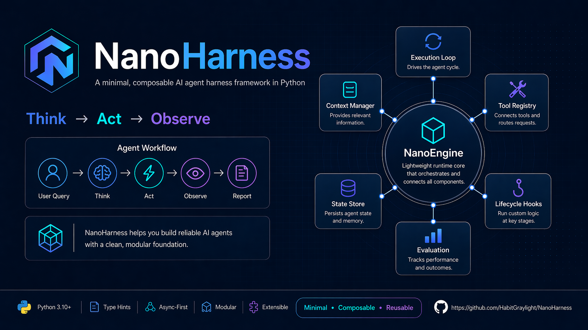

<p align="center">
  
</p>

<p align="center">
  
  
  
  
</p>

<h1 align="center">NanoHarness</h1>

<p align="center">
  <b>基于 H&nbsp;=&nbsp;(E,&nbsp;T,&nbsp;C,&nbsp;S,&nbsp;L,&nbsp;V) 的极简 Agent 框架</b>
</p>

[English](README.md) | 中文

---

## 概述

NanoHarness 是一个极简的 Python Agent 框架，实现了 [Agent Harness Survey](https://github.com/Gloriaameng/Awesome-Agent-Harness) 提出的六组件治理模型：

| | 组件 | 职责 |
|:---:|---|---|
| **E** | 执行循环 | 思考 → 行动 → 观察循环、终止条件、错误恢复 |
| **T** | 工具注册 | 类型化工具目录、路由、Schema 校验 |
| **C** | 上下文管理 | 上下文窗口的组装与压缩 |
| **S** | 状态存储 | 跨轮次持久化与崩溃恢复 |
| **L** | 生命周期钩子 | 横切面插桩：日志、策略、认证 |
| **V** | 评估 | 步骤级轨迹记录与结果报告 |

内核**只**提供这六个接口和一个编排引擎。其余一切——调用哪个 LLM、如何管理记忆、是否执行权限校验——均由应用层决定。

---

## 架构

```
┌─────────────────────────────────────────────────────────────────┐
│                       NanoHarness 内核                           │
│                                                                 │
│   ┌─────────────────────────────────────────────────────────┐  │
│   │  E: NanoEngine                                          │  │
│   │                                                         │  │
│   │    ON_START ──► Think ──► Act ──► Observe ──► ON_STEP   │  │
│   │                    │         │          │                │  │
│   │                    ▼         ▼          ▼                │  │
│   │               LLMProtocol  T: Tools  C: Context         │  │
│   │                                                         │  │
│   │    ON_END ◄── V: Report ◄── S: State ◄────────────────  │  │
│   └─────────────────────────────────────────────────────────┘  │
│                                                                 │
│   接口：  BaseToolRegistry  BaseContextManager                  │
│           BaseStateStore    BaseHookManager                     │
│           BaseEvaluator     LLMProtocol                         │
└─────────────────────────────────────────────────────────────────┘
                              │
                        构造函数注入
                              │
                              ▼
┌─────────────────────────────────────────────────────────────────┐
│                         应用层                                  │
│                                                                 │
│   LLM 适配器  ·  记忆策略  ·  权限策略  ·  工具组装              │
│   Prompt 模板  ·  UI / 输出                                     │
│                                                                 │
│   组装：main.py 或各项目专属 builder                             │
└─────────────────────────────────────────────────────────────────┘
```

**设计原则：** 引擎不知道 Prompt、记忆、权限或 I/O 的存在。所有行为通过注入实现，使内核可安全地在不同 Agent 应用间共享。

---

## 结构

```
nanoharness/
  core/                  # 内核：接口 + 引擎
    schema.py            #   ToolCall, LLMResponse, AgentMessage, StepResult
    base.py              #   ETCSLV ABCs, LLMProtocol, HookStage
    engine.py            #   NanoEngine
    prompt.py            #   PromptManager（YAML 模板加载器）
  components/            # ETCSLV 最简实现
    tools/               #   T: DictToolRegistry, ScriptToolRegistry
    context/             #   C: SimpleContextManager
    state/               #   S: JsonStateStore
    hooks/               #   L: SimpleHookManager
    evaluator/           #   V: TraceEvaluator
  utils/                 # get_logger, count_tokens
configs/
  prompts.yaml           # Prompt 模板
  scripts/               # Shell 脚本工具（自动发现，26 个）
examples/
  coding_agent/          # 完整 Coding Agent 参考
tests/                   # 63 个测试
```

---

## 快速开始

```bash
git clone https://github.com/HabitGraylight/NanoHarness.git
cd NanoHarness
pip install -e .
```

内核无必选外部依赖。LLM 客户端和其他集成由各应用按需安装。

```bash
# 运行最简示例
python main.py

# 运行 Coding Agent
cd examples/coding_agent && python main.py
```

---

## 引擎循环

```
NanoEngine.run(query)
     │
     ├─ L.trigger(ON_TASK_START)
     ├─ C.add_message(user)
     │
     └─ 循环直到终止或达到 max_steps:
          │
          ├─ Think:  E → LLM.chat(C.get_full_context(), T.get_schemas())
          ├─ L.trigger(ON_THOUGHT_READY)
          │
          ├─ Act:    对每个 tool_call:
          │            可选权限门控 → T.call(name, args)
          │            C.add_message(observation)
          │
          ├─ S.save_state()
          ├─ V.log_step()
          └─ L.trigger(ON_STEP_END)

     ├─ V.get_report()
     └─ L.trigger(ON_TASK_END)
```

引擎内部没有记忆、Prompt 渲染或权限逻辑——全部通过注入的组件和钩子流转。

---

## 工具

工具满足 `BaseToolRegistry` 接口，提供两个方法：`get_tool_schemas()` 和 `call(name, args)`。

内置两种注册器：

- **DictToolRegistry** — 通过 `@tool` 装饰器注册 Python 函数，JSON Schema 从类型提示自动推断。
- **ScriptToolRegistry** — 自动发现目录中的 `.sh` 文件，参数通过 `@param` 注释头声明，以环境变量传递。

注册器通过 `merge()` 组合。

添加新工具无需修改 Python 代码——将带有正确头部的 Shell 脚本放入 `configs/scripts/` 即可自动可用。

---

## 扩展

内核定义接口，应用提供具体行为：

**LLM** — 实现 `LLMProtocol`：
```python
def chat(self, messages, tools=None) -> LLMResponse: ...
```

**自定义组件** — 继承任意 `Base*` ABC，注入 `NanoEngine`。

完整参考见 `examples/coding_agent/`，其中组装了自定义 LLM 适配器、记忆策略、权限流水线、子 Agent 委派和技能加载——全部在内核之上构建，无需修改内核。

---

## 测试

```bash
PYTEST_DISABLE_PLUGIN_AUTOLOAD=1 pytest tests/ -v
```

63 个测试覆盖 Schema 模型、引擎循环、工具注册器和所有 ETCSLV 组件。无需外部依赖。

---

## 路线图

- 流式 LLM 输出
- 异步引擎模式
- 多 Agent 编排
- 上下文压缩策略
- 可观测性集成（OpenTelemetry / LangFuse）
- 框架完备度矩阵 — 自动化 ETCSLV 覆盖度报告

---

## 安全

拥有工具访问权限的 Agent 可能造成实际损害。生产部署应实现权限门控、沙箱执行和 Prompt 注入防御。参见 Coding Agent 示例中的权限流水线参考实现。

---

## 引用

```bibtex
@software{nanoharness2026,
  title     = {NanoHarness: A Minimal Agent Harness Based on H=(E,T,C,S,L,V)},
  author    = {Habit},
  year      = {2026},
  url       = {https://github.com/HabitGraylight/NanoHarness},
  license   = {MIT}
}
```

理论基础：

```bibtex
@article{meng2026agentharness,
  title     = {Agent Harness for Large Language Model Agents: A Survey},
  author    = {Meng, Qianyu and Wang, Yanan and Chen, Liyi and others},
  year      = {2026},
  url       = {https://www.preprints.org/manuscript/202604.0428/v2}
}
```

---

## 许可证

MIT
