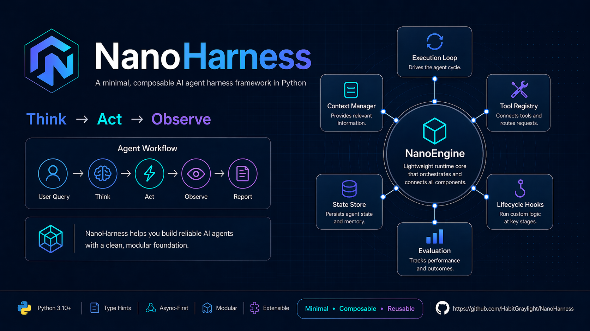

<p align="center">
  
</p>

<p align="center">
  
  
  
  
</p>

<h1 align="center">NanoHarness</h1>

<p align="center">
  <b>基于 H&nbsp;=&nbsp;(E,&nbsp;T,&nbsp;C,&nbsp;S,&nbsp;L,&nbsp;V) 的极简 Agent 框架</b>
</p>

[English](README.md) | 中文

---

## 概述

NanoHarness 是一个极简的 Python Agent 框架，实现了 [Agent Harness Survey](https://github.com/Gloriaameng/Awesome-Agent-Harness) 提出的六组件治理模型：

| | 组件 | 职责 |
|:---:|---|---|
| **E** | 执行循环 | 思考 → 行动 → 观察循环、终止条件、错误恢复 |
| **T** | 工具注册 | 类型化工具目录、路由、Schema 校验 |
| **C** | 上下文管理 | 上下文窗口的组装与压缩 |
| **S** | 状态存储 | 跨轮次持久化与崩溃恢复 |
| **L** | 生命周期钩子 | 横切面插桩：日志、策略、认证 |
| **V** | 评估 | 轨迹记录、循环中早停检测、独立目标验证 |

内核**只**提供这六个接口和一个编排引擎。其余一切——调用哪个 LLM、如何管理记忆、是否执行权限校验——均由应用层决定。

---

## 架构

```
┌─────────────────────────────────────────────────────────────────┐
│                       NanoHarness 内核                           │
│                                                                 │
│   ┌─────────────────────────────────────────────────────────┐  │
│   │  E: NanoEngine                                          │  │
│   │                                                         │  │
│   │    ON_START ──► Think ──► Act ──► Observe ──► ON_STEP   │  │
│   │                    │         │          │       │        │  │
│   │                    ▼         ▼          ▼       ▼        │  │
│   │               LLMProtocol  T: Tools  C: Context         │  │
│   │                                              V: Eval    │  │
│   │                                    should_stop? ──► STOP │  │
│   │                                                         │  │
│   │    ON_END ◄── V: Report + evaluate_success              │  │
│   └─────────────────────────────────────────────────────────┘  │
│                                                                 │
│   接口：  BaseToolRegistry  BaseContextManager                  │
│           BaseStateStore    BaseHookManager                     │
│           BaseEvaluator     LLMProtocol                         │
└─────────────────────────────────────────────────────────────────┘
                              │
                        构造函数注入
                              │
                              ▼
┌─────────────────────────────────────────────────────────────────┐
│                         应用层                                  │
│                                                                 │
│   LLM 适配器  ·  记忆策略  ·  权限策略  ·  工具组装              │
│   Prompt 模板  ·  UI / 输出                                     │
│                                                                 │
│   组装：main.py 或各项目专属 builder                             │
└─────────────────────────────────────────────────────────────────┘
```

**设计原则：** 引擎不包含应用专属的 Prompt、记忆、策略规则、审批界面、沙箱实现或输出 UI。它只编排注入的协议，因此可以安全地在不同 Agent 应用间共享。

---

## 结构

```
nanoharness/
  core/                  # 内核：接口 + 引擎
    schema.py            #   消息、工具执行、Run/Checkpoint、事件与评估协议
    base.py              #   ETCSLV ABCs, LLMProtocol, HookStage
    engine.py            #   NanoEngine（含循环中评估）
    runtime.py           #   RunControl（协作式取消 + Steering）
    prompt.py            #   PromptManager（YAML 模板加载器）
  components/            # ETCSLV 最简实现
    tools/               #   T: DictToolRegistry, ScriptToolRegistry
    context/             #   C: SimpleContextManager
    state/               #   S: JsonStateStore
    hooks/               #   L: SimpleHookManager
    lifecycle/           #   Policy、审批、执行器与事件组件
    evaluator/           #   V: TraceEvaluator（含 should_stop + evaluate_success）
  extensions/            # 可复用能力包
    base.py              #   Manifest、配置、安装与回执协议
    manager.py           #   依赖/冲突校验与安装清单
    memory/              #   FileMemoryManager + MemoryExtension
  utils/                 # get_logger, count_tokens
configs/
  prompts.yaml           # Prompt 模板
  scripts/               # Shell 脚本工具（自动发现，27 个）
examples/
  coding_agent/          # 完整 Coding Agent 参考（434 个测试）
  nano_loop/             # 证据驱动的 Loop Engineering 示例（27 个测试）
tests/                   # 108 个内核测试
```

---

## 快速开始

```bash
git clone https://github.com/HabitGraylight/NanoHarness.git
cd NanoHarness
pip install -e .
```

内核仅依赖 Pydantic 和 PyYAML。LLM 客户端和其他集成由各应用按需安装。

```bash
# 运行最简示例
python main.py

# 运行 Coding Agent
cd examples/coding_agent && python main.py

# 运行证据驱动的 Loop
cd examples/nano_loop
python main.py run configs/loops/local_fix.yaml --repo ../.. --task "你的任务"
```

---

## 引擎循环

```
NanoEngine.run(query)
     │
     ├─ L.trigger(ON_TASK_START)
     ├─ C.add_message(user)
     │
     └─ 循环直到终止或达到 max_steps:
          │
          ├─ Think:  E → LLM.chat(C.get_full_context(), T.get_schemas())
          ├─ L.trigger(ON_THOUGHT_READY)
          │
          ├─ Act:    对每个 tool_call:
          │            PolicyDecision → 可选 ApprovalBroker
          │            → ToolExecutor（注册表 / 沙箱 / 远程）
          │            C.add_message(observation)
          │
          ├─ S.save_state()
          ├─ V.log_step()
          ├─ V.should_stop()?  ──► 若陷入循环/停滞则提前终止
          └─ L.trigger(ON_STEP_END)

     ├─ V.get_report()        （包含 evaluate_success 验证结果）
     └─ L.trigger(ON_TASK_END)
```

引擎内部没有应用策略规则、审批 UI 或沙箱逻辑——全部通过注入的协议实现流转。

---

## Core Protocol v2

核心协议 v2 在保持 `NanoEngine.run(query)` 和原有字典报告兼容的同时，增加了：

- 稳定的 `run_id`、`session_id`、协议版本与运行状态；
- Provider ToolCall ID 的保留，以及 Engine 生成的稳定回退 ID；
- `StepResult.actions` 完整多工具执行轨迹；
- 有序 `HarnessEvent` 事件流与可选 `EventSinkProtocol`；
- 包含查询、轨迹、终止原因和错误的 `RunCheckpoint`；
- 每个 Run 独立的评估轨迹，Context 仍可在同一 Session 内持续；
- `EvaluationResult.achieved` 作为正式成功判定。

旧的 `StepResult.action` 和 `observation` 字段暂时保留，并映射到该步最后一次工具执行。

## 生命周期策略与异步 Runtime

协议 v2.1 为工具生命周期增加了明确边界：

- `ToolPolicyProtocol` 在工具执行前后返回类型化 `PolicyDecision`；
- `ApprovalBrokerProtocol` 将交互式或远程审批从策略判定中分离；
- `ToolExecutorProtocol` 成为本地、沙箱或远程执行的可替换边界；
- `CompositeToolPolicy` 以确定的优先级组合权限策略和 Tool Hook；
- `EventBus`、`RedactingEventSink`、`JsonlEventSink` 和 `ConsoleEventSink` 组成可组合的实时观测管线；
- `NanoEngine.arun()` 与 `NanoEngine.astream()` 分别提供异步报告和实时事件接口；
- `RunControl` 在安全的步骤边界提供协作式取消与 Steering。

旧的 `permissions=` 和 `tool_hooks=` 构造参数继续兼容；Coding Agent Builder 已切换到新的类型化策略与审批路径。

---

## 可复用 Extensions

Extension Protocol 1.0 为可复用能力提供统一的白箱结构：

- `ExtensionManifest` 声明带版本的能力、依赖和冲突；
- 每个 Extension 在安装前即可输出 Pydantic 配置 Schema；
- `ExtensionContext` 是显式的工具、服务和能力安装表面；
- `ExtensionInstallation` 是可序列化的工具与服务安装回执；
- `ExtensionManager.inspect()` 返回解析后的能力清单。

```python
from nanoharness import DictToolRegistry, ExtensionContext, ExtensionManager
from nanoharness.extensions.memory import MemoryExtension

context = ExtensionContext(tools=DictToolRegistry())
extensions = ExtensionManager(context)
extensions.install(MemoryExtension(), {"directory": ".memory"})

print(extensions.inspect())
memory = context.services["memory"]
```

`MemoryExtension` 是第一个完成提取的公共能力。Coding Agent 已直接使用它，原有 `app.memory` 和 `register_memory_tools()` 仅作为兼容转发层保留。

---

## 工具

工具满足 `BaseToolRegistry` 接口，提供两个方法：`get_tool_schemas()` 和 `call(name, args)`。

内置两种注册器：

- **DictToolRegistry** — 通过 `@tool` 装饰器注册 Python 函数，JSON Schema 从类型提示自动推断。
- **ScriptToolRegistry** — 自动发现目录中的 `.sh` 文件，参数通过 `@param` 注释头声明，以环境变量传递。

注册器通过 `merge()` 组合。

添加新工具无需修改 Python 代码——将带有正确头部的 Shell 脚本放入 `configs/scripts/` 即可自动可用。

---

## 扩展

内核定义接口，应用提供具体行为：

**LLM** — 实现 `LLMProtocol`：
```python
def chat(self, messages, tools=None) -> LLMResponse: ...
```

**自定义组件** — 继承任意 `Base*` ABC，注入 `NanoEngine`。

完整参考见 `examples/coding_agent/`，其中组装了自定义 LLM 适配器、记忆策略、权限流水线、子 Agent 委派、技能加载和评估——全部在内核之上构建，无需修改内核。

`examples/nano_loop/` 提供外层 Loop 控制面：反复创建干净的 NanoEngine 运行、验证产物、持久化证据、执行预算策略，并在明确的人工 Gate 停止。

---

## 测试

```bash
# 内核测试（108 个）
PYTEST_DISABLE_PLUGIN_AUTOLOAD=1 pytest tests/ -v

# Coding Agent 测试（434 个：291 UT + 143 ST）
cd examples/coding_agent
PYTEST_DISABLE_PLUGIN_AUTOLOAD=1 pytest tests/ -v

# NanoLoop 测试（27 个）
cd ../nano_loop
PYTEST_DISABLE_PLUGIN_AUTOLOAD=1 pytest tests/ -v
```

**共 569 个测试。** 内核测试只需要内核依赖与 pytest。

---

## 路线图

- 流式 LLM 输出
- 异步引擎模式
- 多 Agent 编排
- 上下文压缩策略
- 可观测性集成（OpenTelemetry / LangFuse）
- 框架完备度矩阵 — 自动化 ETCSLV 覆盖度报告

---

## 安全

拥有工具访问权限的 Agent 可能造成实际损害。生产部署应实现权限门控、沙箱执行和 Prompt 注入防御。参见 Coding Agent 示例中的权限流水线参考实现。

---

## 致谢

本项目的理论基础来自 [Agent Harness Survey](https://github.com/Gloriaameng/Awesome-Agent-Harness)。

---

## 引用

```bibtex
@software{nanoharness2026,
  title     = {NanoHarness: A Minimal Agent Harness Based on H=(E,T,C,S,L,V)},
  author    = {Habit},
  year      = {2026},
  url       = {https://github.com/HabitGraylight/NanoHarness},
  license   = {MIT}
}
```

理论基础：

```bibtex
@article{meng2026agentharness,
  title     = {Agent Harness for Large Language Model Agents: A Survey},
  author    = {Meng, Qianyu and Wang, Yanan and Chen, Liyi and others},
  year      = {2026},
  url       = {https://www.preprints.org/manuscript/202604.0428/v2}
}
```

---

## 许可证

MIT
